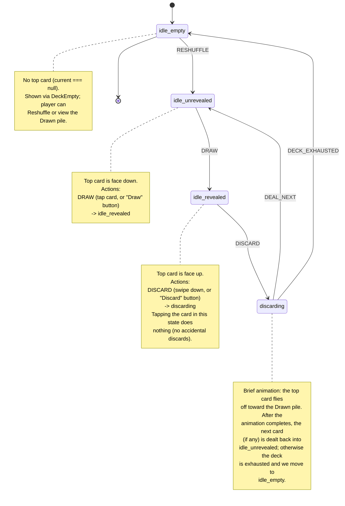

# Deck State Machine

The TopTen deck is governed by a small, explicit state machine. The diagram
below documents the legal states and transitions, mirroring the implementation
in `src/App.svelte`.

## Transition triggers

| Trigger         | Source           | Target              | UI surface                           |
| --------------- | ---------------- | ------------------- | ------------------------------------ |
| `RESHUFFLE`     | `idle_empty`     | `idle_unrevealed`   | `DeckEmpty` "Reshuffle" button       |
| `DRAW`          | `idle_unrevealed`| `idle_revealed`     | Tap on card, or "Draw" bottom button |
| `DISCARD`       | `idle_revealed`  | `discarding`        | Swipe-down on card, or "Discard"     |
| `DEAL_NEXT`     | `discarding`     | `idle_unrevealed`   | Internal: animation completes        |
| `DECK_EXHAUSTED`| `discarding`     | `idle_empty`        | Internal: deck has no more cards     |

## Invariants

- `tap` on a face-up card is a **no-op**.
- `DISCARD` is only honored while `revealed === true`; it is ignored during
  the `discarding` animation and while the deck is empty.
- The `discarding` state always resolves to either `idle_unrevealed` or
  `idle_empty`; it never returns to `idle_revealed` directly.
